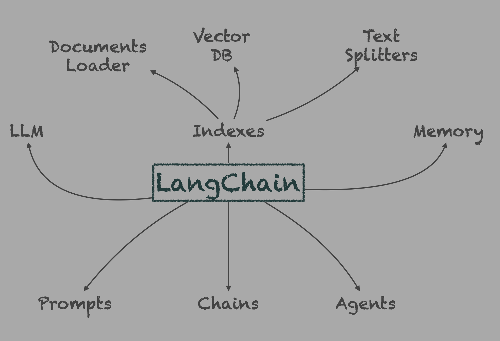

# Introduction à LangChain

**LangChain** est un framework open source conçu pour construire des applications d'intelligence
artificielle autour des modèles de langage (LLMs) comme GPT, Claude ou Mistral. Il a la capacité
de se connecter aux LLMs, à des sources de données, des outils, des chaînes de raisonnement et
des moyens de stockage pour créer des systèmes interactifs et dynamiques.

**LLM** — Les LLMs sont les moteurs de raisonnement, de génération de texte ou de prise de
décision. LangChain les encapsule pour les intégrer facilement dans des workflows intelligents.

**Prompts** — Les prompts sont la manière dont on guide un modèle. LangChain fournit des outils
pour construire des prompts dynamiques, réutilisables et paramétrables.

**Chains** — Une `chain` est une séquence logique d'appels à un LLM et à d'autres composants
(par exemple : extraction d'information → recherche vectorielle → génération de réponse).
Elle permet de créer des **pipelines IA personnalisés** pour des tâches complexes.

**Memory** — LangChain permet de gérer une mémoire conversationnelle, c'est-à-dire la capacité
à se souvenir des échanges passés. Cela rend les interactions plus naturelles et contextuelles
dans les agents ou les chatbots.

**Agents** — Les agents vont plus loin : ils choisissent dynamiquement les actions à effectuer
à partir d'outils disponibles (recherche web, calcul, consultation de base de données…).
Ils peuvent décider quel outil appeler, avec quelles données, et enchaîner plusieurs étapes
de façon autonome.

**Documents Loader**, **Text Splitters**, **Indexes** et **Vector DB** — Ces composants forment
la chaîne d'ingestion de connaissances :

- le Documents Loader charge des documents bruts depuis des fichiers, APIs, bases de données
  ou sites web.
- les Text Splitters découpent ces documents en chunks (morceaux de texte) pour respecter les
  limites de contexte des LLMs.
- le Vector DB : encode les chunks en vecteurs (via des embeddings) et les stocke dans une base
  vectorielle pour permettre une recherche par similarité.
- les Indexes centralisent et organisent ces composants pour structurer une base consultable.
  Ils permettent à un agent ou une chaîne de retrouver les informations pertinentes pour une
  tâche donnée (Q/R, résumé, etc.).

## 1. Chargement du modèle LLM local

Dans cette section, nous chargeons un modèle de langage local grâce à **Ollama**. Cela permet
de travailler avec un **LLM directement sur notre machine**, sans connexion à une API externe.

Nous utilisons ici la classe `ChatOllama` de **LangChain**, qui nous permet d'interagir
facilement avec un modèle comme llama3 déjà téléchargé via Ollama.

## 2. Requête basique

Maintenant que notre modèle est chargé, nous pouvons lui envoyer une première requête simple.
Ici, nous utilisons la méthode `.invoke()` pour poser une question directe.

Cela nous permet de tester rapidement le bon fonctionnement du modèle et d'observer comment
il formule ses réponses.

### 🧩 Exercices

#### Exercice 1

Utilisez le modèle pour transformer une phrase simple en la réécrivant dans un style littéraire
spécifique.

1. Envoyez une requête directe (sans PromptTemplate) via .invoke() contenant :

- une instruction claire au modèle,
- une phrase source,
- le style souhaité (ex. : Shakespeare, roman noir, science-fiction, etc.).

1. Affichez uniquement le résultat retourné par le LLM.

#### Exercice 2

Tu es en mission pour rédiger un message diplomatique adressé à une civilisation extraterrestre
très susceptible.

1. Envoyez une requête au modèle via .invoke() avec un prompt complet :

- contexte fictif : situation tendue,
- contraintes : éviter certains mots, rester poli,
- objectif : obtenir la paix ou proposer une alliance.

1. Observez comment le modèle gère le ton et les instructions.

## 3. Conversations avec le modèle

Même si tout mettre dans un seul message peut fonctionner dans des cas simples, des types de
messages différent nous donne plus de contrôle sur le dialogue et permet de mieux exploiter les
capacités du modèle, surtout dans des systèmes plus complexes comme des agents ou des chatbots.

C'est pour cela que, plutôt que de tout écrire dans une seule phrase, il est recommandé de
distinguer différents types de messages :

- `SystemMessage` : permet de définir le rôle ou le comportement attendu du modèle
  (par exemple : "Vous êtes un assistant qui répond en français").
- `HumanMessage` : correspond à ce que vous demandez réellement au modèle.
- `AIMessage` : représente une réponse précédente du modèle, utile si nous construisons
  une conversation continue.

### 3.1 Conversation sans mémoire (stateless)

Dans l'exemple suivant, nous structurons notre requête en simulant une interaction avec le modèle.
Nous séparons le contexte général (via un SystemMessage) de la question posée (via un HumanMessage).

### 3.2 Conversation avec mémoire (stateful)

Dans l'exemple qui suit, nous simulons une conversation à plusieurs tours avec le modèle.
Nous utilisons un AIMessage pour rappeler la réponse précédente, ce qui permet au modèle de
garder le fil du dialogue et de répondre naturellement à une nouvelle question en lien avec
la précédente.

Dans le second exemple ci-dessous, nous mettons en place une boucle de conversation interactive
avec le modèle.
À chaque échange, la question de l'utilisateur et la réponse du modèle sont ajoutées à
l'historique (`chat_history`).
Cela permet au LLM de garder en mémoire le contexte et de répondre de façon plus cohérente
tout au long de la discussion.

### 🧩 Exercices

> Exercice 1

1. Créez une liste messages avec :

- un SystemMessage qui indique que l'IA est un expert dans un domaine de ton choix
  (maths, histoire, cinéma, etc.),
- un HumanMessage qui pose une question à l'IA.

1. Envoyez cette liste à model.invoke(messages) et affiche la réponse.

> Exercice 2

Créer une mini-conversation avec l'IA, où chaque question/réponse est ajoutée à l'historique
des messages. L'IA doit se souvenir de l'échange précédent.

1. Initialisez une liste messages avec un SystemMessage définissant le rôle de l'IA.
2. Dans une boucle :

- Demandez une question à l'utilisateur (input()),
- Ajoutez un HumanMessage à la liste,
- Envoyez la liste complète à model.invoke(...),
- Affichez la réponse de l'IA,
- Ajoutez cette réponse comme AIMessage à la liste.

1. Arrêtez la boucle si l'utilisateur entre "stop".

## 4. Conversations avec le modèle à l'aide de Prompt Templates

Nous allons explorer l'utilisation de `ChatPromptTemplate`, un outil qui permet de structurer
proprement les messages envoyés à un modèle de type "chat" (comme GPT-4).

`ChatPromptTemplate` permet de construire une conversation multi-rôle en distinguant les messages
système (règles, rôle de l'IA), humains (questions ou commandes) et les réponses de l'IA.

### 4.1 Prompt conversation à rôle unique (human)

Ce type de prompt utilise la fonction `.from_template( )` et est de type `human` par défaut,
c'est un prompte simple "tout en un" où il n'est pas possible de contrôler le rôle.

### 4.2 Prompt conversation à rôles multiples (system, assistant, human)

Ce type de prompt utilise la fonction `.from_messages( )` et permet de définir **plusieurs
messages avec des rôles explicites** (system, human, etc.).
C'est un prompt structuré, idéal pour guider précisément le comportement du modèle dans un
contexte conversationnel.

### 🧩 Exercices

> Exercice 1

Construire un assistant capable d'adopter le style d'un philosophe célèbre pour répondre à des
questions existentielles.

1. Créez un ChatPromptTemplate avec :

- un message system définissant l'IA comme un philosophe précis ({philosopher}),
- un message human contenant une question {question}.

1. Injectez des variables avec :

- un nom de philosophe (ex. : Socrate, Nietzsche, Simone de Beauvoir),
- une question philosophique.

1. Affichez la réponse du modèle, en observant si le style correspond au philosophe choisi.

> Exercice 2

Simulez une conversation entre un utilisateur et un LLM autour d'un sujet (ex. : mathématiques,
littérature, programmation) en construisant dynamiquement le prompt avec `ChatPromptTemplate`.

Implémentez une boucle qui :

- Initialise un prompt avec un message system.

À chaque tour :

- Prend une entrée utilisateur (input()),
- Ajoute un message human,
- Envoie le tout au LLM,
- Affiche la réponse,
- Ajoute un message de type/role `assistant` contenant la réponse (💡 ce rôle correspond à
  la réponse de l'IA et est l'équivalent de AIMessage).
- Arrête la conversation si l'utilisateur entre "stop".
